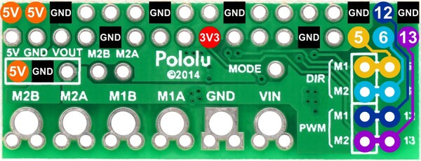

# Build instruction

## Components

## Pinouts 




## Connection guideline

```
  ESP32S3         DRV8835
    GND     -->     GND             # Common ground
    3V3     -->     3V3             # 3.3V power to the motor driver IC
    D1      -->     GPIO5           # Left/Right direction
    D2      -->     GPIO6           # Forward/Reverse direction
    D3      -->     GPIO12          # Steering PWM
    D4      -->     GPIO13          # Throttle PWM
```

## References

- DRV8835 documentation: https://www.pololu.com/product/2753
- ESP32S3 documentation: https://wiki.seeedstudio.com/xiao_esp32s3_pin_multiplexing/

